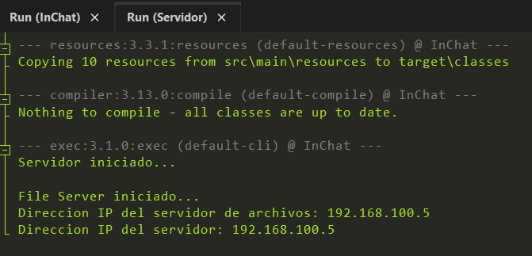
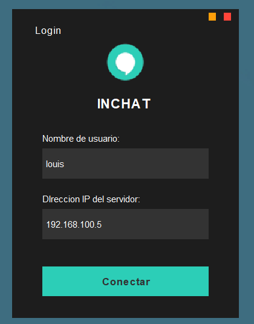
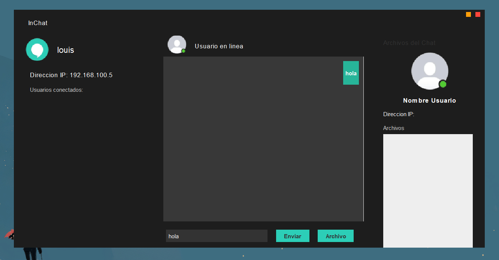

# CHAT LOCAL EN JAVA
# INCHAT


  


**In Chat** is a local chat application that allows multiple users to connect to a common server, chat in real time and share files quickly and easily, without relying on the Internet.

---

## ✨ Features

- Real-time chat between users connected to the same local network
- File transfer between users and server
- Modern and responsive interface
- Easy to deploy in private networks or LANs

---

## 📸 Screenshots

**Step 1: Starts the server**  
in the project packages you will find a file called “server/Servidor”, and run it. The IP address of the server will be shown in the console:



**Step 2: Connect to the server**  
Then start the main file “inchat/InChat”, it will show you the window where you can choose your user name and the IP address of the server:



**Step 3: Start chatting!**  
Now you can invite your friends to connect to the server, following the same steps.



---

## 🖥️ Technologies

This project is powered by:

- **Java** – Programming language used for the core logic and UI
- **JDK 21** – Java Development Kit used to compile and run the project
- **Maven** – For dependency management and building the project
- **Sockets** – For real-time communication between server and clients
- **Apache Netbeans** – Is the IDE that is necesary for compile this project

---

## ⚙️ Installation

Clone this repository and run the app locally with just a few commands:

```bash
git clone https://github.com/Luis3Fernando/InChat
```
Import this proyect in Apache Netbeans
